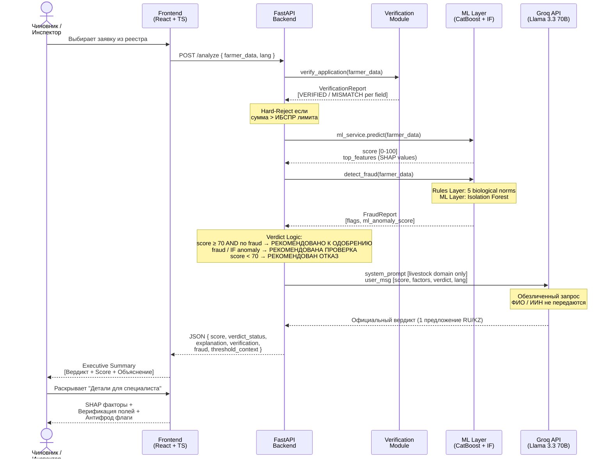
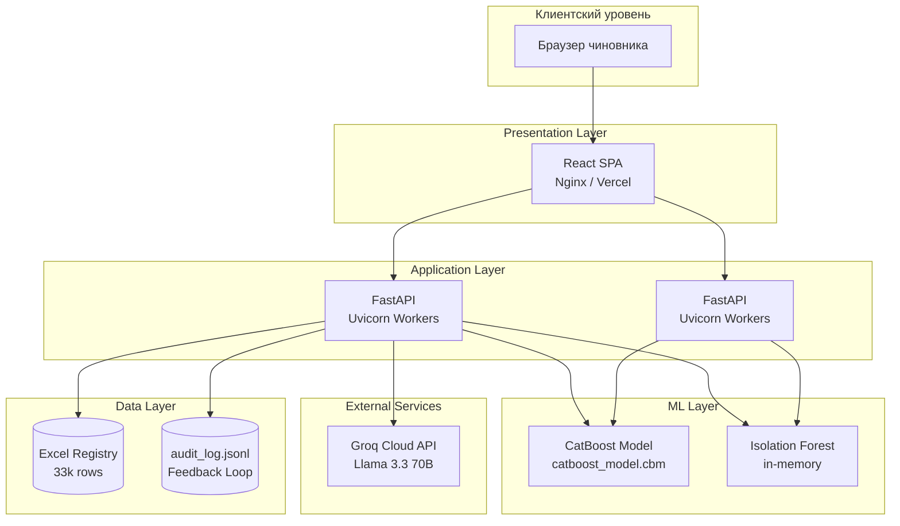

# 🏛️ ARCHITECTURE — AgroScore AI Decision Support System

> Техническая архитектура государственной системы поддержки решений по распределению субсидий в племенном животноводстве РК

---

## 1. Sequence Diagram — Путь данных



---

## 2. Компоненты системы

### 🗄️ Data Layer

**Источник:** Реестр заявок на субсидии МСХ РК (Excel, 13 колонок)

**Датасет:** `merit_scoring_dataset_33k.xlsx`

| Параметр | Значение |
|----------|---------|
| Строк | 33 000 |
| Признаков модели | 9 |
| Категориальных | 4 (Область, Направление, Наименование, Статус) |
| Числовых | 4 (рост, падёж, сумма, эффективность) |
| Бинарных | 2 (автоматизация, нарушения) |
| Тип | Синтетический, на основе реальной структуры реестра |

**Обогащение:**
- `generate_merit_dataset.py` — синтетическая генерация с нелинейными взаимодействиями признаков
- `prepare_ml_data.py` — обучение CatBoost (5-Fold CV), экспорт `catboost_model.cbm`

---

### 🤖 ML Layer

#### CatBoost Regressor (Scoring)

```
Вход:  9 признаков заявки
Выход: score ∈ [0, 100]

Гиперпараметры:
  - iterations: 500
  - learning_rate: 0.05
  - depth: 6
  - loss_function: RMSE
  - cat_features: [Область, Направление, Наименование, Статус]

Validation: 5-Fold Cross-Validation
Explainability: SHAP TreeExplainer
```

**Ключевой SHAP-паттерн (ожидаемый):**
```
Автоматизация:           +20.9%   (позитивный сигнал)
Процент роста:           +5.3%    (умеренный прирост = норма)
История нарушений:       -15.3%   (сильный негативный сигнал)
Показатель падежа:       -11.7%   (высокий падёж = риск)
```

#### Isolation Forest (Anomaly Detection)

```
Вход:  [growth, mortality, amount, automation, violations]
Выход: anomaly_score ∈ [-1, 0]  (ближе к -1 → аномалия)

Обучение: 500 синтетических «нормальных» профилей (seed=42)
Порог:    score_samples < -0.15 → ML_ANOMALY флаг
Загрязнение (contamination): 5%
```

**Бизнес-логика:**
- Если `ML_ANOMALY` + `score ≥ 70` → блокировка в `РЕКОМЕНДОВАНА ПРОВЕРКА`
- AI-Score не занижается автоматически — инспектор принимает решение

#### Rules-Based Anti-Fraud (Layer 1)

| Код правила | Норма | Ссылка |
|-------------|-------|--------|
| `BIO_GROWTH_EXCESSIVE` | Прирост > 50% без документов | Правила субсидирования, п. 15 |
| `BIO_CONTRADICTION_GROWTH_MORTALITY` | Рост > 20% И падёж > 10% | Вет. нормы РК — КРС ≤ 5% |
| `RISK_VIOLATIONS_HIGH_AMOUNT` | Нарушения + сумма > 10 млн ₸ | Правила субсидирования, п. 8 |
| `FRAUD_AUTOMATION_MISMATCH` | Автоматизация + эффективность < 20 | Правила субсидирования, п. 12 |
| `RISK_ZERO_GROWTH_HIGH_SUBSIDY` | Нулевой прирост + сумма > 5 млн ₸ | Правила субсидирования, п. 6 |

---

### ⚡ API Layer

**Фреймворк:** FastAPI 0.115+ / Uvicorn (ASGI)  
**Файл:** `backend/main.py`

```
POST /analyze          — Полный пайплайн (Score + Fraud + Verify + LLM)
GET  /applications     — Реестр (первые 100 записей из Excel)
GET  /health           — Healthcheck (статус модели)
POST /feedback         — Feedback Loop API (аудиторские исходы)
GET  /audit-stats      — Статистика feedback-записей
```

**Verdict Decision Tree:**
```
hard_reject (MISMATCH сумма)?
  └─ YES → "РЕКОМЕНДОВАН ОТКАЗ"
requires_field_inspection (high/medium fraud)?
  └─ YES → "РЕКОМЕНДОВАНА ПРОВЕРКА"
ml_anomaly AND score ≥ 70?
  └─ YES → "РЕКОМЕНДОВАНА ПРОВЕРКА"
score ≥ threshold (default 70)?
  └─ YES → "РЕКОМЕНДОВАНО К ОДОБРЕНИЮ"
  └─ NO  → "РЕКОМЕНДОВАН ОТКАЗ"
```

---

### 🗣️ AI Layer (LLM Explainability)

**Провайдер:** Groq Cloud API  
**Модель:** `llama-3.3-70b-versatile`  
**Параметры генерации:** `temperature=0.2`, `max_tokens=150`

**Архитектура промпта:**
```
[system]: Строгое ограничение домена — только животноводство РК.
          ЗАПРЕЩЕНО: темы вне сельского хозяйства.
          Формат: 1 абзац, официальный язык госдокумента.

[user]:   Нейтральные данные заявки (score, factors, verdict).
          Без персональных идентификаторов.
```

**Fallback:** При недоступности Groq — детерминированный шаблон на основе `verdict_directive` и `factors_text`.

---

### 🖥️ UI Layer

**Стек:** React 19 + TypeScript + Tailwind CSS 3 + Framer Motion  
**Файл:** `frontend/src/App.tsx`

**Паттерн Executive Summary:**
```
┌─────────────────────────────┐
│  [ВЕРДИКТ крупно]  [Score]  │  ← Первый экран (только суть)
│  Объяснение LLM (1 фраза)  │
├─────────────────────────────┤
│  ▼ Детали для специалиста   │  ← Коллапс (для инспектора)
│    Верификация ИСЖ/ИБСПР    │
│    Антифрод флаги + IF score│
│    SHAP факторы             │
│    Z-статус                 │
└─────────────────────────────┘
```

**Цветовая семантика вердикта:**

| Вердикт | Цвет | Иконка |
|---------|------|--------|
| РЕКОМЕНДОВАНО К ОДОБРЕНИЮ | 🟢 `#B6FF00` | ✓ |
| РЕКОМЕНДОВАНА ПРОВЕРКА | 🟡 `#F59E0B` | ⚠ |
| РЕКОМЕНДОВАН ОТКАЗ | 🔴 `#DC2626` | ✗ |

---

## 3. 🔐 Security & Privacy

### Обезличивание данных перед отправкой в LLM

Критически важным требованием для государственных систем является защита персональных данных граждан. В AgroScore AI реализована следующая политика:

```
Данные заявки (полные)         Данные, передаваемые в Groq
──────────────────────         ──────────────────────────
✅ ФИО заявителя       →  ❌  НЕ ПЕРЕДАЁТСЯ
✅ ИИН / БИН           →  ❌  НЕ ПЕРЕДАЁТСЯ
✅ Адрес хозяйства     →  ❌  НЕ ПЕРЕДАЁТСЯ
✅ Контакты            →  ❌  НЕ ПЕРЕДАЁТСЯ
──────────────────────         ──────────────────────────
✅ Область (регион)    →  ✅  передаётся (агрегированно)
✅ AI-Score (число)    →  ✅  передаётся
✅ SHAP-факторы        →  ✅  передаётся (без имён)
✅ Вердикт для промпта →  ✅  передаётся
```

### Принципы безопасности

| Принцип | Реализация |
|---------|-----------|
| **Data Minimization** | В LLM передаётся минимальный набор агрегированных данных |
| **Sovereignty** | Вердикт — рекомендация ИИ, финальное решение остаётся за человеком |
| **Auditability** | Все вердикты и флаги логируются с источником (ИСЖ/ИБСПР/КГИ) |
| **Transparency** | SHAP объясняет каждый балл, пользователь видит причину |
| **Fallback** | При отказе Groq система продолжает работу (детерминированный ответ) |

### Feedback Loop (Аудит)

```
POST /feedback — принимает реальный исход инспектора
Хранилище: audit_log.jsonl (локально, без передачи третьим сторонам)
Применение: переобучение модели (команда: python prepare_ml_data.py --include-audit)
Минимум: 100 записей для статистически значимого переобучения
```

---

## 4. Нефункциональные характеристики

| Параметр | Значение |
|----------|---------|
| Время ответа `/analyze` (без LLM) | < 200 мс |
| Время ответа `/analyze` (с Groq) | 1–3 сек |
| Время загрузки модели CatBoost | ~500 мс (один раз при старте) |
| Поддерживаемые языки | RU, KZ |
| Браузерная поддержка | Chrome, Firefox, Safari (последние 2 версии) |
| Масштабируемость | Stateless API — горизонтальное масштабирование через load balancer |

---

## 5. Схема развёртывания (Target Architecture)



> **Текущее развёртывание:** Single-instance (localhost). Для production рекомендуется Docker Compose с nginx reverse proxy и минимум 2 Uvicorn workers.
