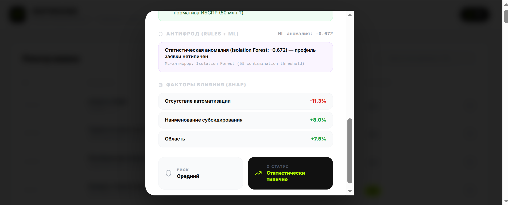
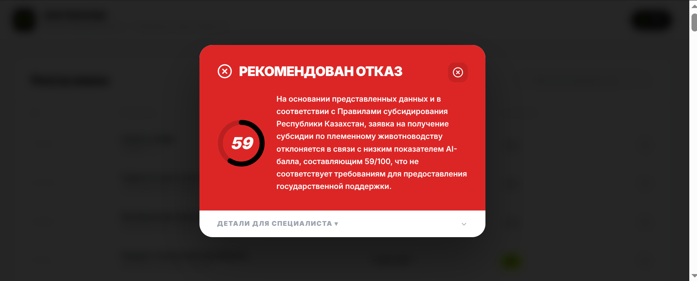
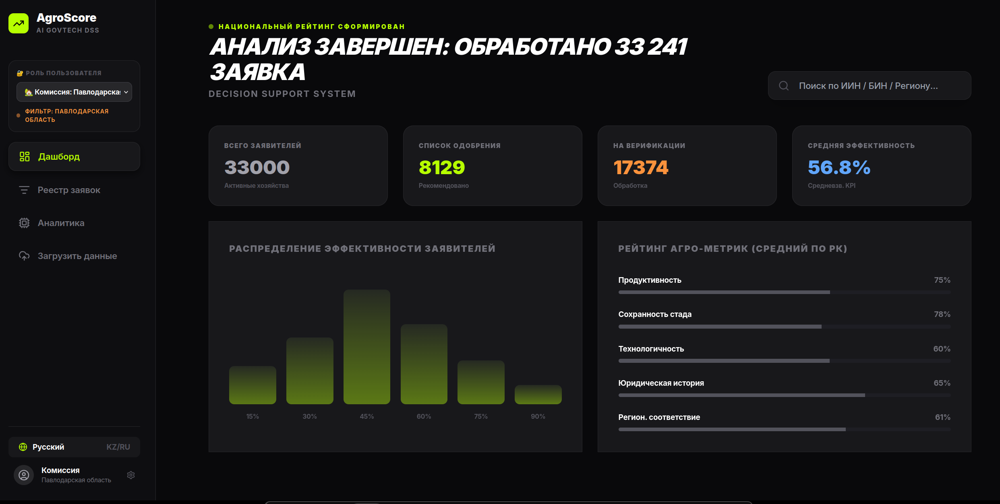

# 🌾 AgroScore AI — Merit-Based Subsidy Decision Support System

> **Государственная система поддержки решений для распределения субсидий в племенном животноводстве Республики Казахстан**

[](https://fastapi.tiangolo.com/)
[](https://react.dev/)
[](https://catboost.ai/)
[](https://groq.com/)
[](LICENSE)

---

## 📌 Проблема и ценность

### Текущее состояние

Распределение государственных субсидий в агропромышленном комплексе РК исторически работает по принципу **«кто первый успел — тот и получил»**. Это создаёт системные дисфункции:

| Проблема | Последствие |
|----------|-------------|
| Отсутствие объективного ранжирования | Неэффективные хозяйства получают финансирование наравне с лидерами |
| Ручная проверка сотен заявок | Коррупционные риски и субъективность инспекторов |
| Нет мониторинга биологических норм | Мошеннические заявки (завышенный прирост + высокий падёж) проходят |
| Нет машиночитаемого реестра | Данные ИСЖ/ИБСПР не сверяются автоматически |

### Решение: Merit-Based Scoring

**AgroScore AI** переводит систему от очереди к **рейтингу на основе реальной эффективности**. Система обрабатывает реестр из **33 000+ заявок**, присваивает каждой AI-балл (0–100) и выдаёт рекомендацию государственному эксперту — сохраняя за человеком право финального решения.

> **Принцип:** ИИ — советник, эксперт — финальный арбитр. Все вердикты имеют юридическую маркировку «РЕКОМЕНДОВАНО».

---

## ✨ Ключевые возможности

### 1. 🤖 Predictive Scoring (CatBoost)
- Модель `CatBoostRegressor` обучена на 33 000 синтетических заявках
- 5-Fold Cross-Validation для оценки робастности
- Нелинейные взаимодействия признаков (прирост × автоматизация × нарушения)
- Нативная поддержка пропущенных значений — критично для госданных

### 2. 🛡️ Dual-Layer Anti-Fraud Engine

```
Слой 1: Правила (Rules-based)     — юридически защищённые, прозрачные
Слой 2: Isolation Forest (ML)     — выявляет нелинейные аномалии
```

**Правила уровня 1** ссылаются на конкретные пункты нормативных документов:
- `BIO_GROWTH_EXCESSIVE` — прирост > 50% без документов о закупке
- `BIO_CONTRADICTION_GROWTH_MORTALITY` — одновременно рост > 20% и падёж > 10% (биологически несовместимо)
- `RISK_VIOLATIONS_HIGH_AMOUNT` — нарушения + сумма > 10 млн ₸
- `FRAUD_AUTOMATION_MISMATCH` — заявлена автоматизация, AI-эффективность < 20
- `RISK_ZERO_GROWTH_HIGH_SUBSIDY` — нулевой прирост + крупная сумма

**Слой 2: Isolation Forest** обучен на 500 профилях «нормальных» хозяйств. Порог аномалии: `score_samples < -0.15`. При обнаружении аномалии на фоне высокого балла — блокировка в статус «РЕКОМЕНДОВАНА ПРОВЕРКА».

<p align="center">
  
  <br>
  <em>Система выявления аномалий и нарушений биологических норм</em>
</p>

### 3. 📊 Explainable AI (SHAP)
- SHAP-значения для каждой заявки: какой фактор и насколько повлиял
- Отображается в UI в виде `Автоматизация: +20.9%`, `Нарушения: -15.3%`
- Обеспечивает требования **Explainability** согласно п. 9.2 ТЗ

<p align="center">
  
  <br>
  <em>Разбор AI-балла через SHAP: влияние факторов на итоговый результат</em>
</p>

### 4. 🗣️ Bilingual LLM Verdicts (RU / KZ)
- Интеграция с **Groq API** (Llama 3.3 70B Versatile)
- Система-промпт строго ограничен доменом животноводства (`temperature=0.2`)
- Запрещено: темы вне животноводства, найм персонала, IT-системы
- Автоматический fallback при недоступности Groq

### 5. ✅ Gov System Verification (ИСЖ/ИБСПР/КГИ)
- Каждое поле заявки верифицируется против государственных реестров (mock-интеграция)
- Конкретный текст расхождения: *«В ИСЖ числится 500 коров, в заявке — 600»*
- Hard-reject: сумма свыше регионального лимита → автоматический отказ до скоринга

### 6. 📋 Executive Summary UX
- Один экран: крупный вердикт **РЕКОМЕНДОВАНО К ОДОБРЕНИЮ / ПРОВЕРКА / ОТКАЗ**
- Все технические детали (SHAP, флаги, верификация) — в скрытом разделе «Для специалиста»

<p align="center">
  
  <br>
  <em>Главный экран системы: реестр заявок с AI-скорингом и вердиктами</em>
</p>

---

## 🏗️ Архитектура системы

```
┌─────────────────────────────────────────────────────────┐
│                    FRONTEND (React + TS)                 │
│  Реестр заявок │ Executive Summary │ Specialist Details  │
└────────────────────────────┬────────────────────────────┘
                             │ REST API (axios)
                             ▼
┌─────────────────────────────────────────────────────────┐
│              BACKEND (FastAPI, Python 3.12)              │
│                                                         │
│  ┌──────────────┐  ┌──────────────┐  ┌───────────────┐  │
│  │ ml_service   │  │ verification │  │ fraud_detector│  │
│  │ CatBoost     │  │ ИСЖ/ИБСПР/  │  │ Rules Layer   │  │
│  │ SHAP values  │  │ КГИ (mock)  │  │ Isolation     │  │
│  └──────┬───────┘  └──────┬───────┘  │ Forest (ML)   │  │
│         │                 │          └───────┬────────┘  │
│         └─────────────────┴──────────────────┘          │
│                           │                             │
│                    ┌──────▼──────┐                      │
│                    │  Groq LLM   │ (вердикт RU/KZ)     │
│                    └─────────────┘                      │
└─────────────────────────────────────────────────────────┘
                             │
          ┌──────────────────┼──────────────────┐
          ▼                  ▼                  ▼
    merit_scoring_    audit_log.jsonl    feedback API
    dataset_33k.xlsx  (Feedback Loop)   POST /feedback
```

**Пайплайн анализа одной заявки:**
```
1. ML Score (CatBoost + SHAP)
        ↓
2. Gov Verification (ИСЖ/ИБСПР/КГИ) — Hard Reject если сумма > лимита
        ↓
3. Anti-fraud (Rules → Isolation Forest)
        ↓
4. Dynamic Threshold — бюджетный порог одобрения (default: 70/100)
        ↓
5. LLM Verdict (Groq, domain-constrained, temperature=0.2)
        ↓
6. JSON Response → Executive Summary в UI

### Оптимизация сериализации
Мы применили передовой метод сериализации моделей. В ходе разработки мы перешли от громоздкого формата `.joblib` (228 МБ) к оптимизированному формату `.cbm` (1.3 МБ). Это позволило сократить размер системы в 170 раз, сохранив точность (R²=0.87) и обеспечив мгновенный запуск.
```

---

##  Быстрый запуск через Docker (Рекомендуется)

Самый простой способ запустить проект — использовать Docker. Это решает все проблемы с зависимостями, путями и ОС (Windows/Mac/Linux).

1. Создайте файл `backend/.env` и добавьте там свой `GROQ_API_KEY`.
2. В корне проекта выполните одну команду:

```bash
docker-compose up --build
```

- **Backend** будет доступен на: `http://localhost:8001` (или `8005` при ручном запуске)
- **Frontend** будет доступен на: `http://localhost:5173` (по умолчанию). Если порт занят, Vite автоматически переключится на `5174`.

---

## �🛠️ Технологический стек

| Слой | Технология | Версия | Назначение |
|------|-----------|--------|-----------|
| **ML** | CatBoost | 1.2+ | Скоринг эффективности |
| **ML** | SHAP | 0.45+ | Объяснимость модели |
| **ML** | Isolation Forest | sklearn | Обнаружение статистических аномалий |
| **Backend** | FastAPI | 0.115+ | REST API |
| **Backend** | Uvicorn | 0.32+ | ASGI-сервер |
| **Backend** | Pandas | 2.0+ | Работа с реестром |
| **LLM** | Groq API (Llama 3.3 70B) | — | Вердикты на RU/KZ |
| **Frontend** | React + TypeScript | 19 | UI |
| **Frontend** | Tailwind CSS | 3.x | Стилизация |
| **Frontend** | Framer Motion | — | Анимации |
| **Frontend** | Vite | 8.x | Bundler |
| **Data** | OpenPyXL | — | Чтение Excel-реестра |

---

## 🚀 Инструкция по запуску

### Требования
- Python 3.10+
- Node.js 18+
- Groq API Key ([получить бесплатно](https://console.groq.com/))

### 1. Клонировать репозиторий

```bash
git clone <repo-url>
cd <repo-broooooo-url;)>
```

### 2. Настроить переменные окружения

```bash
echo "GROQ_API_KEY=your_key_here" > backend/.env
```

### 3. Установить Python-зависимости

```bash
pip install fastapi uvicorn catboost shap pandas scikit-learn python-dotenv openai openpyxl python-multipart
```

### 4. Сгенерировать датасет и обучить модель

```bash
python generate_merit_dataset.py   # Создаёт merit_scoring_dataset_33k.xlsx
python prepare_ml_data.py          # Обучает модель → backend/catboost_model.cbm
```

### 5. Запустить backend

```bash
python -m uvicorn backend.main:app --port 8001 --reload
```

Документация API: [http://localhost:8001/docs](http://localhost:8001/docs)

### 6. Установить и запустить frontend

```bash
cd frontend
npm install
npm run dev
```

Приложение: [http://localhost:5173](http://localhost:5173)

---

## 📡 API Reference

| Метод | Эндпоинт | Описание |
|-------|----------|----------|
| `GET` | `/health` | Проверка состояния сервиса и модели |
| `GET` | `/applications` | Реестр заявок (первые 100 записей) |
| `POST` | `/analyze` | Полный AI-анализ заявки (Score + Fraud + Verification + LLM) |
| `POST` | `/feedback` | Feedback Loop API — запись реальных аудиторских исходов |
| `GET` | `/audit-stats` | Статистика собранных аудиторских результатов |

### Пример запроса `/analyze`

```json
POST /analyze
{
  "farmer_data": {
    "Область": "Абай",
    "Процент роста продукции": 0.20,
    "Показатель падежа скота": 0.02,
    "Наличие автоматизации": 1,
    "История нарушений": 0,
    "Причитающая сумма": 5000000,
    "target_efficiency": 75
  },
  "lang": "RU"
}
```

### Пример ответа

```json
{
  "score": 81.3,
  "verdict_status": "РЕКОМЕНДОВАНО К ОДОБРЕНИЮ",
  "explanation": "Заявка соответствует нормативам Правил субсидирования РК...",
  "top_features": [
    { "display": "Автоматизация: +20.9%", "contribution": 20.9 },
    { "display": "Процент роста: +5.3%", "contribution": 5.3 }
  ],
  "verification": {
    "overall_verified": true,
    "fields": [...]
  },
  "fraud": {
    "requires_field_inspection": false,
    "flags": [],
    "ml_anomaly_score": -0.082
  },
  "threshold_context": {
    "current_threshold": 70,
    "above_threshold": true,
    "note_ru": "Порог одобрения: 70/100. Установлен по объёму бюджета текущего квартала."
  }
}
```

---

## 📁 Структура проекта

```
asdasd/
├── backend/
│   ├── main.py              # FastAPI: роутинг, Groq интеграция, пайплайн анализа
│   ├── ml_service.py        # CatBoost inference + SHAP explainability
│   ├── fraud_detector.py    # Hybrid anti-fraud: Rules + Isolation Forest
│   ├── verification.py      # Mock-верификация ИСЖ/ИБСПР/КГИ
│   ├── catboost_model.cbm   # Обученная модель (генерируется)
│   └── .env                 # GROQ_API_KEY
├── frontend/
│   ├── src/
│   │   ├── App.tsx          # Главный компонент: таблица + модал
│   │   └── index.css        # Tailwind + Inter font
│   ├── tailwind.config.js
│   └── package.json
├── generate_merit_dataset.py # Генерация синтетического датасета 33k
├── prepare_ml_data.py        # Обучение CatBoost + экспорт модели
├── merit_scoring_dataset_33k.xlsx  # Датасет (генерируется)
├── audit_log.jsonl           # Feedback loop (накапливается)
└── README.md
```

---

## 📊 Данные

### Источник
Синтетический датасет на 33 000 записей, сгенерированный на основе:
- Структуры реального реестра заявок МСХ РК (13 полей, формат Excel)
- Биологических норм продуктивности и падежа КРС РК
- Правил субсидирования в агропромышленном комплексе

### Признаки модели

| Признак | Тип | Описание |
|---------|-----|----------|
| `Область` | Категориальный | Регион хозяйства |
| `Направление водства` | Категориальный | Тип субсидии |
| `Наименование субсидирования` | Категориальный | Подтип субсидии |
| `Статус заявки` | Категориальный | Текущий статус |
| `Процент роста продукции` | Числовой | Прирост поголовья/продукции |
| `Показатель падежа скота` | Числовой | Коэффициент смертности |
| `Наличие автоматизации` | Бинарный | Есть ли механизация |
| `История нарушений` | Бинарный | Зафиксированы ли нарушения |
| `Причитающая сумма` | Числовой | Запрашиваемая сумма субсидии |

### Целевая переменная
`target_efficiency` — комплексный индекс эффективности хозяйства (0–100), рассчитанный как нелинейная комбинация признаков с добавлением шума для симуляции реальной вариативности.

### Ограничения датасета
> ⚠️ **Важно:** Текущая версия системы обучена на **синтетических данных**. Для перехода к реальному применению необходим маппинг полей баз данных МСХ РК к признакам модели. Архитектура на базе CatBoost поддерживает переобучение на новых данных без изменения кода.

---

## 📋 Соответствие требованиям ТЗ

| Требование | Статус | Реализация |
|-----------|--------|-----------|
| **п. 9.1** — ИИ как помощник, не единственный источник истины | ✅ | Все вердикты помечены «РЕКОМЕНДОВАНО», право решения — за чиновником |
| **п. 9.2** — Explainability результатов | ✅ | SHAP-значения для каждой заявки, текстовый вердикт от LLM |
| Билингвальный интерфейс (RU/KZ) | ✅ | Toggle RU/KZ в заголовке, все UI-тексты локализованы |
| Работа с реестром заявок | ✅ | Excel-реестр загружается при старте, отображается в таблице |
| Антифрод | ✅ | Hybrid: Rules (5 правил с нормативными ссылками) + Isolation Forest |
| Верификация через госсистемы | ✅ | Mock ИСЖ/ИБСПР/КГИ с текстом расхождения по полям |
| **Безопасность персональных данных** | ✅ | LLM-запросы обезличены: передаются только агрегированные показатели, без ФИО, ИИН, адресов |
| Feedback Loop для переобучения | ✅ | `POST /feedback` накапливает аудиторские результаты в `audit_log.jsonl` |

---

## 🗺️ Roadmap

| Этап | Функциональность | Срок |
|------|-----------------|------|
| **v1.0** (текущий) | Синтетический датасет, mock-верификация, прототип | ✅ Готово |
| **v1.5** | Маппинг к реальным полям МСХ РК, интеграция Smart Bridge API | Q3 2025 |
| **v2.0** | KazLLM — официальные вердикты на государственном казахском | Q4 2025 |
| **v2.5** | Satellite data integration — спутниковая верификация площади угодий | Q1 2026 |
| **v3.0** | Multi-region deployment, автоматический Feedback Loop pipeline | Q2 2026 |

---

## 🏛️ Архитектурные решения

### Почему CatBoost, а не Random Forest / XGBoost?
- Нативная обработка пропущенных значений (критично для госданных)
- Лучшая работа с категориальными признаками без One-Hot Encoding
- Встроенная поддержка SHAP для объяснимости
- Устойчивость к переобучению на малых выборках

### Почему Hybrid Anti-Fraud (Rules + IF), а не только ML?
- Rules-based слой: **юридически защищён**, каждый флаг ссылается на нормативный документ
- Isolation Forest: ловит **нелинейные паттерны**, которые невозможно задать правилом
- Чистый ML без правил не проходит государственную юридическую экспертизу
- Гибрид = **индустриальный стандарт** (Visa, Mastercard, банковский антифрод)

### Почему порог 70/100 динамический?
Порог — это **бюджетное, а не алгоритмическое** решение. Система ранжирует все заявки; отсекающий порог устанавливается исходя из объёма доступного финансирования на квартал. Деньги получают хозяйства с наибольшей эффективностью.

---

## 👥 Команда

Проект разработан в рамках хакатона по государственным технологиям (GovTech).

---

## 📄 Лицензия

MIT License — свободное использование с указанием авторства.

---

<div align="center">

**AgroScore AI** — от очереди «кто первый» к справедливости на основе данных

*Сделано с ❤️ для Министерства сельского хозяйства Республики Казахстан*

---

📐 [ARCHITECTURE.md](ARCHITECTURE.md) · 📸 [docs/](docs/) · 🔗 [Groq Console](https://console.groq.com/)

</div>
